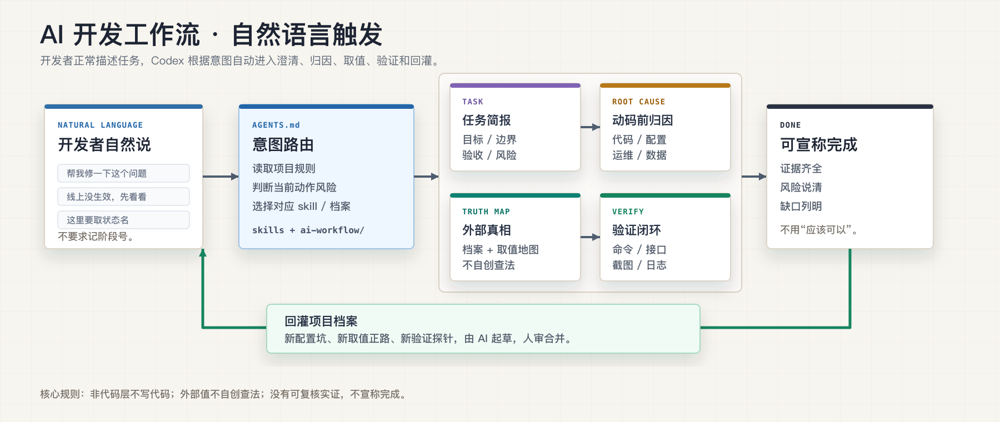

# 四阶段 AI 开发工作流

一套 Codex-first 的 AI 开发工作流。它把“模糊需求先澄清、异常先归因、外部事实先核对、跨层取值走正路、完成前拿证据”做成可复用的 skills 和项目 `AGENTS.md` 约束，让开发者用自然语言就能触发，不需要背阶段号。

适合真实业务系统：配置中心、权限系统、流程引擎、数据字典、远端 CI、缓存、手工部署、数据库迁移差异等因素都会影响结果。工作流的目标不是多一层仪式，而是让 AI 少猜、少绕、少把“看起来改完”当成“真的完成”。



## 文件导航

| 文件 | 是什么 | 给谁 |
|---|---|---|
| `四阶段蓝图.md` | 规范性总览（脊柱） | 想懂全貌 |
| `推广手册.md` | 为什么/三天起步/量化胜仗/回应质疑 | 负责人、推广 |
| `环境真相档案.md` | 外部真相 + **取值地图本体** + 空白模板 | 落进每个项目根 |
| `取值地图增补.md` | 给 `code-self-review` 加 §6.9（查绕路非裸数字） | `deploy.sh --install-review-addon` |
| `AGENTS.md片段-自然语言路由.md` | 自然语言意图路由 | 注入项目 `AGENTS.md`，Claude Code 同步 `CLAUDE.md` |
| `skills/ai-task-preflight/SKILL.md` | 模糊任务澄清：把一句话收敛成任务简报 | 安装进 Codex/Claude skills |
| `skills/verify-closure/SKILL.md` | 收尾验证：没有实证不下完成结论 | 安装进 Codex/Claude skills |
| `skills/attribute-rootcause/SKILL.md` | 动码前归因：代码/配置/运维/数据先定层 | 安装进 Codex/Claude skills |
| `claude-skills/four-stage-install/SKILL.md` | Claude Code 命令入口：`/four-stage-install` | 全局装一次 |
| `install-claude-command.sh` | 安装 Claude Code 命令入口 | Claude Code 用户可选 |
| `安装.sh` | 一键软链三个 Skill（幂等/可卸载） | `bash 安装.sh`（旧版，推荐用 `deploy.sh`） |
| `deploy.sh` | **一键部署**：全局 Skills + 项目级模板 + `AGENTS.md` / `CLAUDE.md` 注入 | `bash deploy.sh /path/to/project` |
| `四阶段工作流.html` | 静态说明页，用于讲解方法论 | 浏览器直接打开 |
| `四阶段使用说明.html` | 静态使用说明页：安装、调用、排错 | 给同事照着操作 |

## 推荐入口：Codex

在目标业务 repo 根目录直接接入工作流：

```bash
cd /path/to/business-repo
curl -fsSL https://raw.githubusercontent.com/Coder42Y/four-gate-ai-workflow/master/bootstrap.sh -o /tmp/four-stage-bootstrap.sh
bash /tmp/four-stage-bootstrap.sh
```

部署完成后启动 Codex：

```bash
codex
```

这会把 workflow skills 安装到 `~/.agents/skills/`，生成 `ai-workflow/`，并把自然语言路由注入当前项目的 `AGENTS.md`。Codex 后续从这个业务 repo 启动时，会读取 `AGENTS.md`，并可隐式触发 `ai-task-preflight`、`attribute-rootcause`、`verify-closure` 三个 skills。

## Claude Code 兼容入口

Claude Code 用户可以先全局安装一次 `/four-stage-install`，之后每个新业务 repo 里用 slash command 接入：

```bash
curl -fsSL https://raw.githubusercontent.com/Coder42Y/four-gate-ai-workflow/master/install-claude-command.sh -o /tmp/four-stage-install-claude-command.sh
bash /tmp/four-stage-install-claude-command.sh
```

之后在业务 repo 根目录启动 Claude Code，输入：

```text
/four-stage-install
```

它会在**当前业务 repo** 自动执行本地缓存的 bootstrap，生成 `ai-workflow/`，注入 `AGENTS.md` / `CLAUDE.md`，并安装/更新 workflow skills。日常 coding 不需要进入本仓库。

## 命令行部署

不使用远程 bootstrap 时，也可以 clone 本仓库后直接运行：

```bash
# 仅全局安装（软链 Skills 到 ~/.agents/skills/ 和 ~/.claude/skills/）
bash deploy.sh

# 全局 + 部署到指定项目（自动探测技术栈、生成模板、注入 AGENTS.md / CLAUDE.md）
bash deploy.sh /path/to/your/project

# 安装 code-self-review 的取值地图增补（自动写入受管块，可重复运行升级）
bash deploy.sh --install-review-addon

# 部署项目时同时安装取值地图增补
bash deploy.sh --with-review-addon /path/to/your/project

# 查状态
bash deploy.sh --check /path/to/your/project

# 卸载
bash deploy.sh --uninstall /path/to/your/project
```

部署后需手动完成：编辑 `ai-workflow/环境真相档案.md` 中的 `[待填]` 项。

`四阶段工作流.html` 是方法论介绍页，适合打开给团队讲这套方法；`四阶段使用说明.html` 是操作说明页，供同事第一次照着安装和调用。真正的落地入口是 Codex 下的 `bootstrap.sh` / `deploy.sh`；Claude Code 用户可继续用 `/four-stage-install`。项目内落地资产是生成到业务 repo 的 `ai-workflow/` 文档和项目说明文件。

> 旧版 `安装.sh` 仍可用（仅做全局 skill 软链），建议迁移到 `deploy.sh`。

## 日常使用：自然语言触发

不用记“阶段 0/1/2/3”。在业务 repo 里正常对 Codex 说话即可：

| 你说的话 | 会触发的工作流 |
|---|---|
| `帮我实现这个需求，但先帮我问清楚` | `ai-task-preflight` 收敛任务简报 |
| `这个接口线上没生效，先别急着改代码` | `attribute-rootcause` 先归因 |
| `这里要取业务状态名，按取值地图走` | 先查环境真相档案 §四 |
| `验证一下这次改动是否真的生效` | `verify-closure` 输出实证清单 |
| `这次踩到一个配置坑，帮我回灌` | 起草档案候选条目 |

Codex 也会在准备宣称“已完成/已修复/可以合并”前自动进入验证闭环。缺实证时，正确输出是“未验证完成，缺哪些证据”，不是用“应该可以了”补位。

## 最小起步（三天）

0. **装**：Codex 用户在业务 repo 根目录直接跑远程 `bootstrap.sh`；Claude Code 用户可先装 `/four-stage-install`。
1. **Day1** 启用 `ai-task-preflight` + `verify-closure`：先把需求问清楚，再立铁律“没实证不说修好了”。
2. **Day2** 完善 `ai-workflow/环境真相档案.md`，AI 每会话先读。
3. **Day3** 建立取值地图 + 执行 `bash deploy.sh --install-review-addon` 并进 `code-self-review` §6.9。

详见 `推广手册.md` §4。

## 真正新建的日常 Skill 只有 3 个

开工准备、验证、归因。安装入口只负责把本工作流接入当前业务 repo，不参与日常编码判断。取值地图复用 `code-self-review`；真相档案是文档；回灌是写进 `AGENTS.md` / `CLAUDE.md` 的习惯。**刻意不臃肿。**
